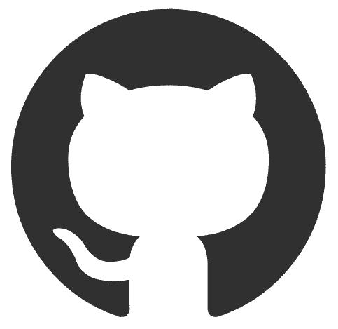

## Olá 👋

### 🎖 Analista de Desenvolvimento de Sistemas PLENO II na PH3A
🎯 São Paulo - BR
  
<a href="https://wa.me/11912220082" target="_blank">+55 11 91222-0082</a>

  
<a href="mailto:rafael_ska@live.com">rafael_ska@live.com</a>

 

  
  
  
  
  
  
  
  
  
  
  
  
  

<!--
**RafaelSka/RafaelSka** is a ✨ _special_ ✨ repository because its `README.md` (this file) appears on your GitHub profile.

Here are some ideas to get you started:

- 🔭 I’m currently working on ...
- 🌱 I’m currently learning ...
- 👯 I’m looking to collaborate on ...
- 🤔 I’m looking for help with ...
- 💬 Ask me about ...
- 📫 How to reach me: ...
- 😄 Pronouns: ...
- ⚡ Fun fact: ...
-->
